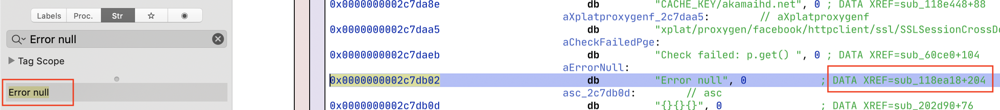
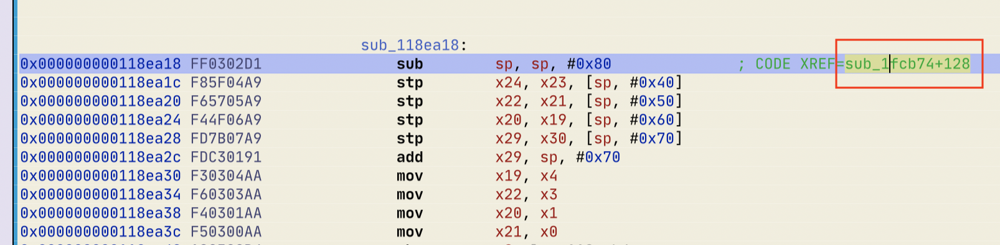
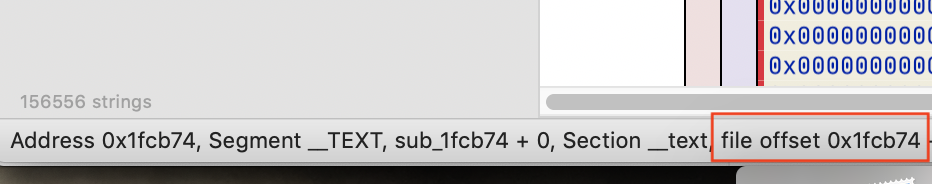
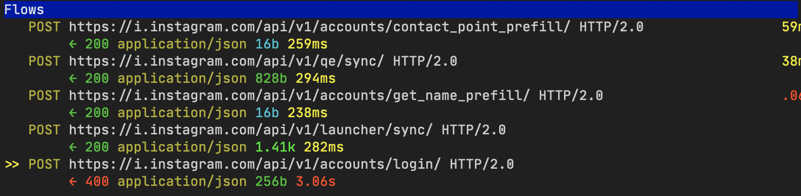
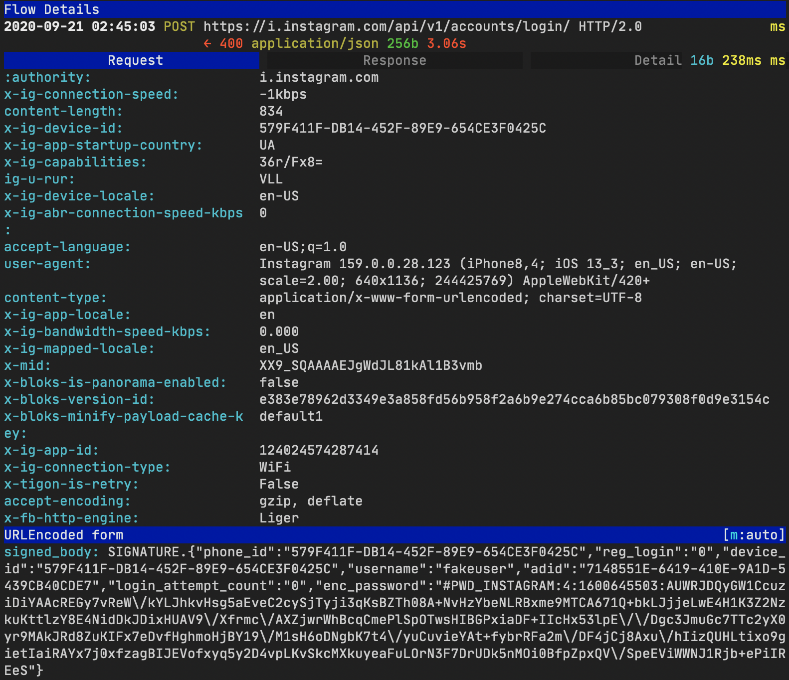
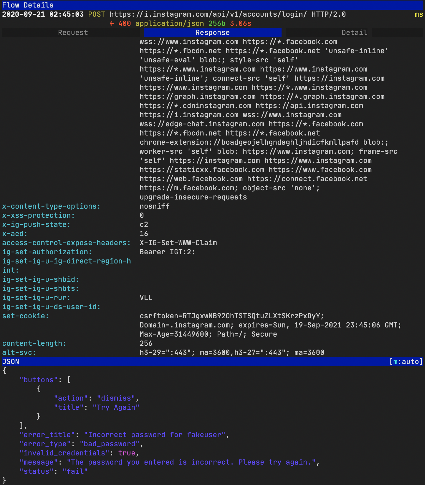
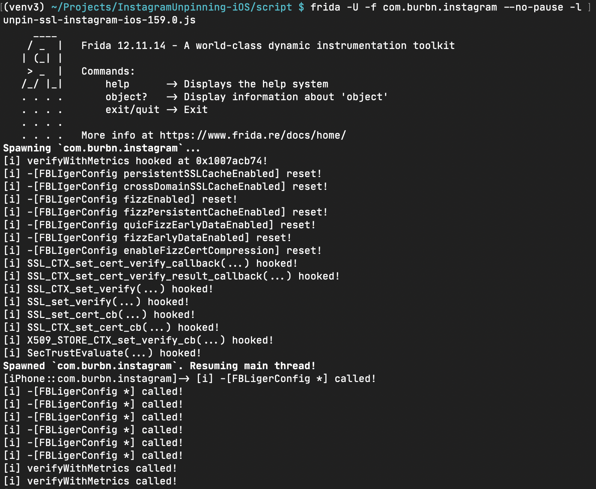

# FAQ

## What does the script do?

It bypasses SSL pinning for Instagram 154.0 and later on iOS.

## Can we use some "master key" tool to bypass Instagram SSL pinning?

"Master key" tools ([SSLKillSwitch](https://github.com/nabla-c0d3/ssl-kill-switch2), [MEDUZA](https://github.com/kov4l3nko/MEDUZA) etc) work with iOS system libs: patch system function, spoof data etc. Instagram does not use iOS system libs, it uses a statically linked and slightly obfuscated fork of OpenSSL. That is why "master key" tools do not work :(

## How to prepare a testing environment for the script? 

You'll need:

* A Mac with MacOS Mojave or later (maybe the script works on Windows and Linux as well, but it was not tested)
* A jailbroken iOS device (the script was tested on iPhone SE 2016 with iOS 13.3 jailbroken by [checkra1n](https://checkra.in/); theoretically, it should work with other devices as well, but it was not tested)
* The latest [Frida](https://frida.re/) installed on the Mac and the iOS device.
* [Mitmproxy](https://mitmproxy.org/) installed on the Mac (the script was not tested with other sniffers like Charles proxy, I'm not sure it will work)
* The Mac and iOS device should be connected with a USB data cable and connected to the same WiFi network.
* Instagram 157.0 or later is installed on the iOS device

## How to customize the script?

If you are going to unpin Instagram 157.0 or 159.0, just find `unpin-ssl-instagram-ios-<your veriosn>.js` in `script/` directory, skip this section and start reading the next one. Otherwise you should customize the script for your Instagram version before use it.

What does the script need customization? Among other things, the script patches the function called `verifyWithMetrics` in the private framework called `FBSharedFramework`. The problem is the binary contains no symbolic information (debug info, export etc) about the function, so the script can't find the function by name. You should help the script to find the function. Don't worry, it's simple:

**WARNING!** _The following instruction was created for Instagram 159.0. It's the latest Instagram version in AppStore for now (Sep 21, 2020). All xrefs and offsets on the screenshots below came from this version._

1. SSH your jailbroken iOS device, find the binary `FBSharedFramework` (it should be located in Instagram app bundle), and copy the binary to your Mac

2. Open the binary with your favorite disassembler (I prefer [Hopper](https://www.hopperapp.com/), but it's up to you) and let the disassembler process the binary. Then find `Error null` string and the only xref to the string.

    

3. Follow the xref, it will take you to a function. In Instagram 159.0, it's `sub_118ea18`. Scroll to the beginning of the function and find the only xref to the function:

    

4. Follow the xref, it will take you to another function. In Instagram 159.0, it's `sub_1fcb74`. **This is `verifyWithMetrics`, the function you're looking for!** Remember the file offset of the function

    

5. Copy `unpin-ssl-instagram-ios-157.0.js` to `<any name you want>.js`, e.g. `unpin-ssl-instagram-ios-159.0.js`. Open the copied script and fix the `verifyWithMetrix` offset in line 8:

    ```
    var verifyWithMetrixFileOffset = 0x1fcb74;
    ```

Thats it!

## How to use the script?

1. Run `ifconfig | grep "inet "` in your Mac Terminal to see your Mac's IP address.

2. Run Mitmproxy on your Mac

3. On your iOS device, set the Mac's IP and mitmproxy port (`8080` by default) as a proxy for the WiFi connection.

4. Run the script in Mac Terminal

    ```
    $ frida -U -f com.burbn.instagram --no-pause -l <whatever you named it>.js
    ```

    e.g.

    ```
    $ frida -U -f com.burbn.instagram --no-pause -l unpin-ssl-instagram-ios-159.0.js
    ```

As result, you should see Instagram HTTP(s) traffic in mitmproxy:







